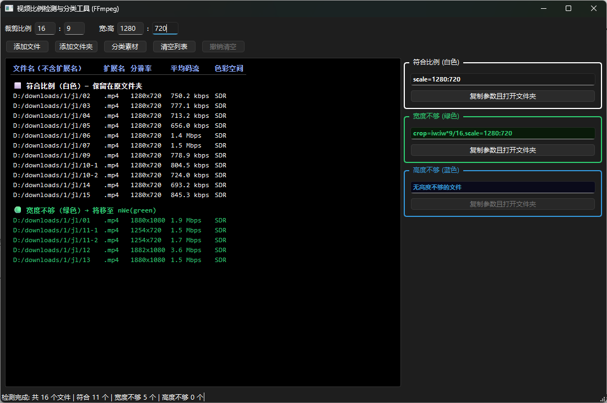

# 3fuiParameter - 视频比例检测与分类工具

自动检测视频分辨率、码流、色彩空间，为 FFmpeg 生成准确的裁剪（crop）和缩放（scale）参数。

## ✨ 功能特点

- 📹 批量检测视频：分辨率、平均码流、色彩空间（SDR/HDR）
- 🎯 自动分类：符合比例 / 宽度不够 / 高度不够
- ⚙️ 一键生成 FFmpeg 滤镜参数
- 📂 支持添加文件或文件夹，自动去重
- 🗂️ 按分类自动移动文件到对应文件夹
- 🔄 参数联动：修改比例自动计算分辨率
- 📊 表格展示，清晰直观

## 🖥️ 界面预览



## 📦 系统要求

- Windows 10/11
- [FFmpeg](https://www.gyan.dev/ffmpeg/builds/) 已安装并添加到 PATH
- Python 3.8+（如需运行源码）

## 🚀 快速开始

### 方式一：直接运行源码（推荐）

```bash

# 安装依赖

pip install PySide6

# 运行程序

python 3fuiParameter.pyw
